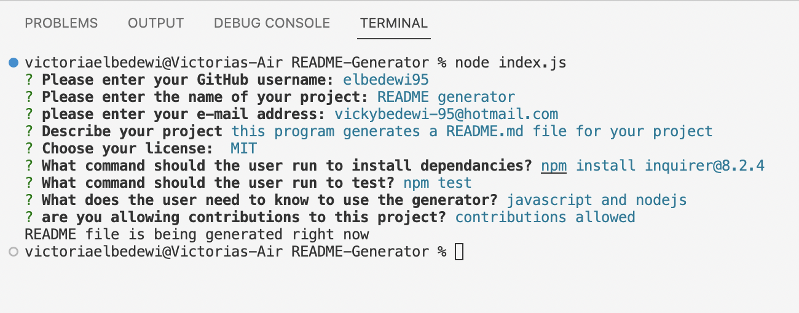

README File Generator

Title: README generator

License: 

Description:
    
This program generates a README.md file for your project, it was created using NodeJS.

Table Of Contents:
1.  <a href= "#inst">Installation</a>
2. <a href= "#use">Usage</a>
3. <a href= "#contr">Contributing</a>
4. <a href= "#test">Testing</a>
5. <a href= "#questions">Questions</a>
6. <a href= "#screenshot">Screenshot</a>
7. <a href= "#video">Demo Video</a>

   

1.  
Installation:

To install run the following commands:
    
npm install inquirer@8.2.4

2. 
Usage:

javascript and nodejs

3. 
Contributions:

contributions allowed

4. 
Testing:

    
npm test

5. 
Questions: 

E-mail: vickybedewi-95@hotmail.com
GitHub: github.com/elbedewi95

6. 
 Screenshot: 

   

 
7. 
 Demo Video: 

   
<video>
<source src="demo-video.webm" type="video/mp4">
</video>

